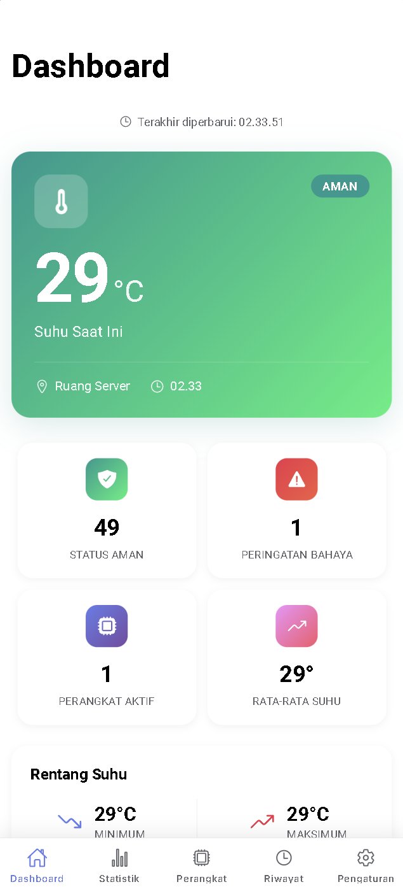
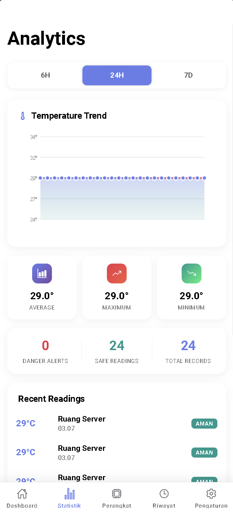
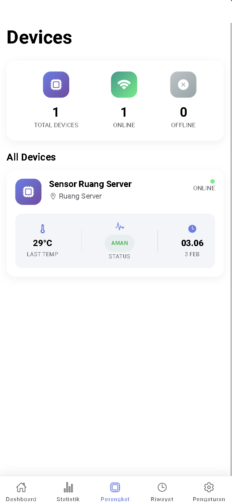
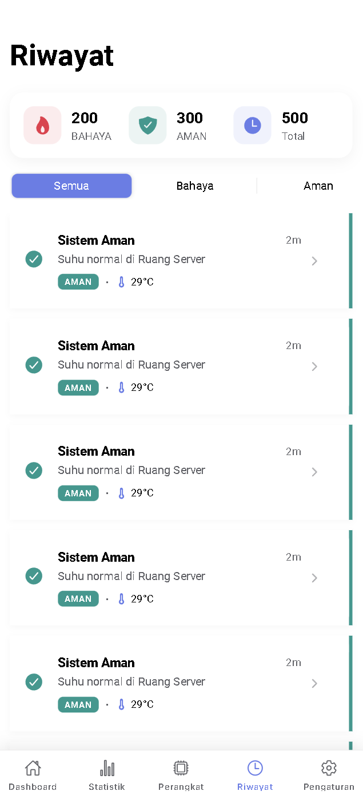
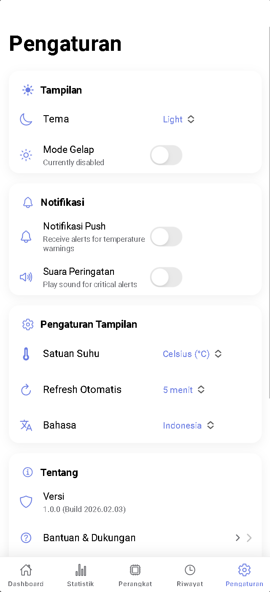
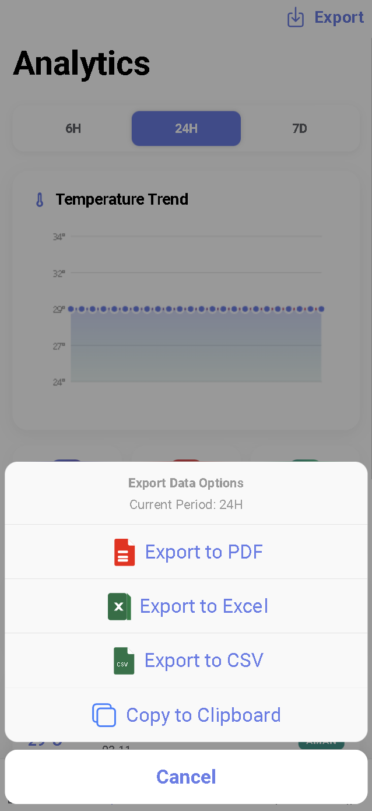
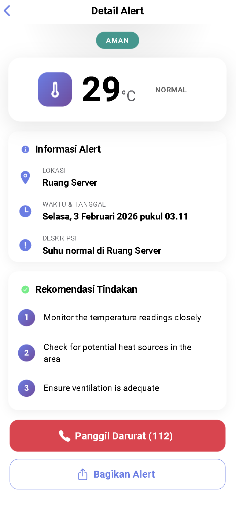

# 🔥 IoT Fire Detection System (Mobile App)


A modern, high-performance mobile dashboard application for monitoring IoT Fire Detection sensors in real-time. Built with **Ionic Framework** and **Angular**, meant to be deployed as a PWA or Native Android/iOS App using **Capacitor**.

## 📸 App Screenshots

<p align="center">
  
  
  
</p>
<p align="center">
  
  
  
</p>
<p align="center">
  
</p>

## 📱 Features

- **Real-time Monitoring**: Live dashboard showing current temperature, device status (Safe/Danger), and active sensor count.
- **Smart Alerts**:
  - **Push Notifications**: Receive instant notifications when a sensor detects danger.
  - **Alert Sounds**: Plays a distinct alarm sound during danger states (Respects browser autoplay policies).
- **History Logs**: View complete sensor history logs with sorting and filtering.
- **Analytics**: 
  - Visual representation of temperature trends and device performance.
  - **Export Data Features**: Generate professional reports in **PDF, Excel (.xlsx), and CSV** formats.
  - **Smart Actions**: Copy filtered data directly to system clipboard for quick sharing.
- **Device Management**: List of active sensors and their last known locations.
- **Customizable Settings**:
  - **Dark/Light Mode**: Full theme support including system preference detection.
  - **Multi-language**: Support for English and Indonesian (Bahasa Indonesia).
  - **Auto-refresh**: Configurable data polling intervals.
  - **Temperature Units**: Toggle between Celsius and Fahrenheit.

## 🛠️ Tech Stack

- **Framework**: Ionic Framework v7+
- **Core**: Angular (Standalone Components, Signals, RxJS)
- **Runtime**: Capacitor (for Native Mobile access)
- **Styling**: SCSS (Custom Design System)
- **API Integration**: REST API (Laravel Backend)

## 🚀 Getting Started

### Prerequisites

Ensure you have the following installed:
- [Node.js](https://nodejs.org/) (LTS version recommended)
- [Ionic CLI](https://ionicframework.com/docs/cli): `npm install -g @ionic/cli`

### Installation

1.  **Clone the Repository**
    ```bash
    git clone https://github.com/your-username/iot-fire-detection-app.git
    cd iot-fire-detection-app
    ```

2.  **Install Dependencies**
    ```bash
    npm install
    ```

3.  **Configure Environment**
    Copy `src/environments/environment.ts` and ensure your API URL is correct.
    ```typescript
    export const environment = {
      production: false,
      apiUrl: 'https://your-api-endpoint.com/api' // Update this
    };
    ```

4.  **Run Locally (Browser)**
    ```bash
    ionic serve
    ```
    The app will open at `http://localhost:8100`.

## 📱 Building for Mobile (Android)

1.  **Build the Web Assets**
    ```bash
    ionic build
    ```

2.  **Sync with Capacitor**
    ```bash
    npx cap sync
    ```

3.  **Open in Android Studio**
    ```bash
    npx cap open android
    ```
    From Android Studio, you can build the APK or run on an emulator/device.

## 📁 Project Structure

```
src/
├── app/
│   ├── core/           # Services (API, Settings, Theme), Models, Guards
│   ├── pages/          # Application Pages (Dashboard, Alerts, Settings, etc.)
│   └── ...
├── assets/             # Images, Icons, Sound Files (fire-alarm.mp3)
├── theme/              # Global SCSS variables
└── environments/       # API Configuration
```

## 🔒 Audio & Permissions

This app implements strict **Browser Autoplay Policies** for the Alert Sound feature.
- Audio is only "unlocked" after the first user interaction (tap/click).
- Audio playback logic is handled centrally in `SettingsService` for reliability across Web and Mobile.

## 📄 License

This project is licensed under the MIT License - see the [LICENSE](LICENSE) file for details.
